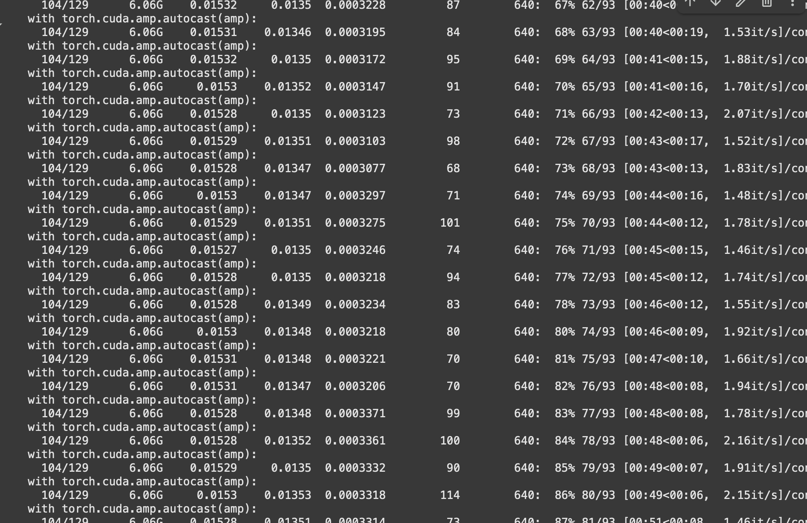
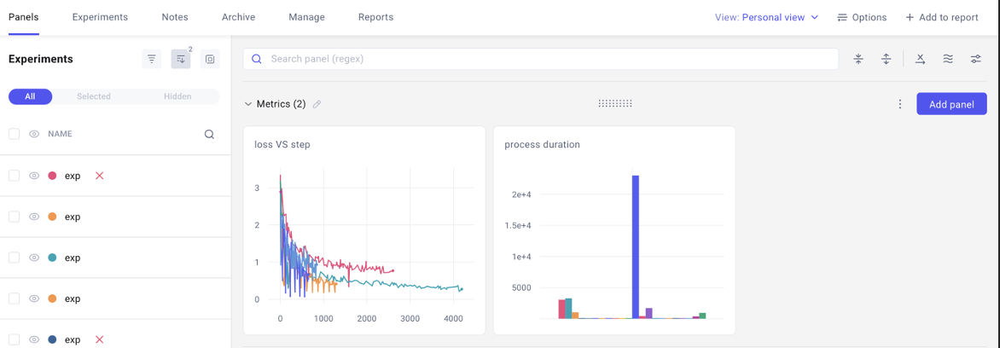
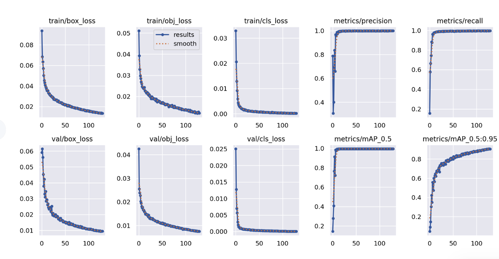
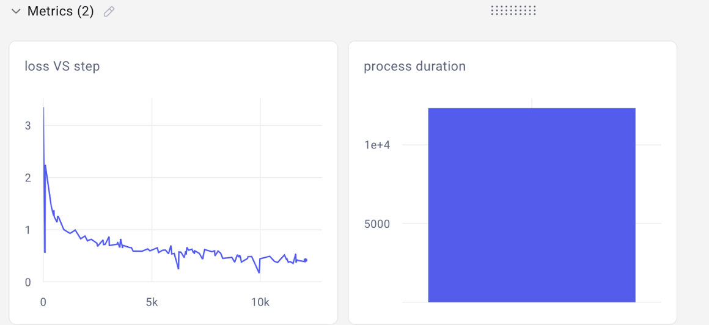
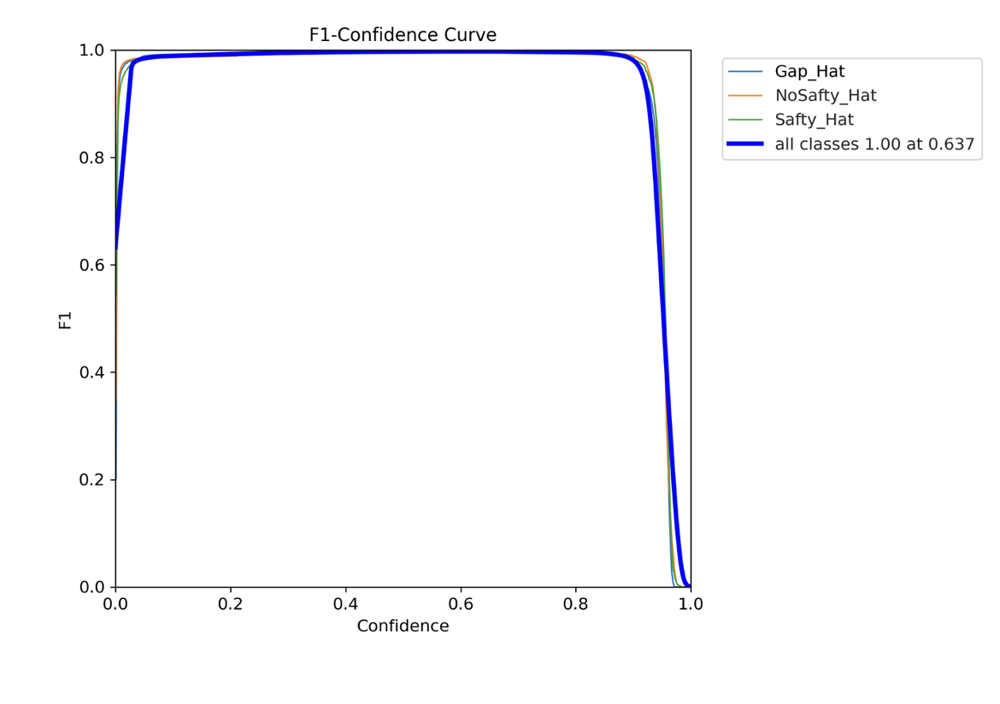
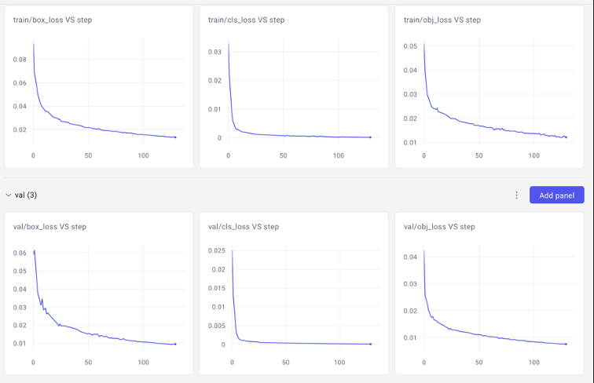
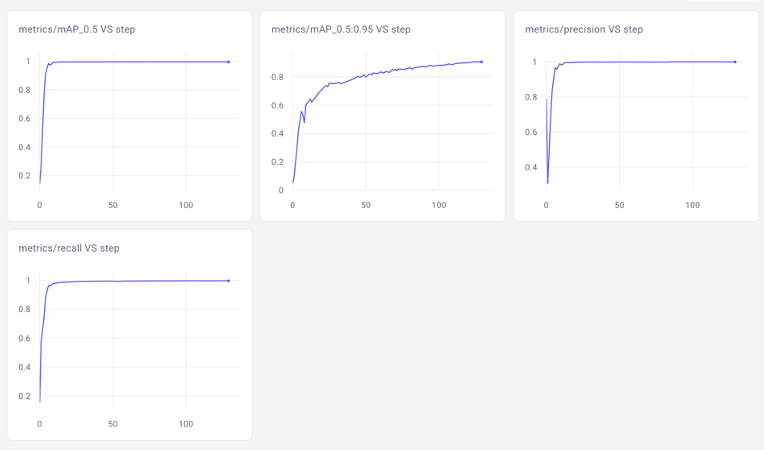
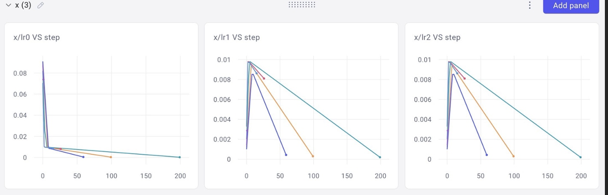

# HatScan – YOLOv5 Safety Helmet Detection


โปรเจคนี้คือโมเดล YOLOv5 สำหรับตรวจจับหมวกนิรภัย (Safety Helmet) ที่เทรนบน Google Colab ซึ่งเราใช้ชุดข้อมูล Annotated จาก Roboflow และบันทึกน้ำหนักโมเดล (`.pt`)  **เราสามารถ clone repo นี้ แล้วรัน inference ได้ทันที** โดยไม่ต้องเทรนใหม่ โดยใช้ไฟล์ [bestSaftyHatScanaaaaaaa](weights/bestSaftyHatScanaaaaaaa.pt)


---

## 🔧 โครงสร้าง Repo เขียนโดย Worachot Teerak และ Ashiraya Mungtanya(ผู้ช่วย)

```
HatScan-YOLOv5/
├─ assets/                 # รูปตัวอย่าง/ภาพผลลัพธ์ สำหรับ README
│  └─ samples/             # รูปทดสอบสำหรับ inference
├─ data/
│  └─ HatScan.yaml         # ไฟล์ dataset config (ปรับ path ให้ตรงกับของคุณ)
├─ notebooks/
│  └─ HatScan_inference.ipynb  # โน้ตบุ๊กสาธิตโหลดน้ำหนักและรันตรวจจับ
├─ scripts/
│  └─ predict.py           # สคริปต์รัน inference ผ่าน CLI (ใช้ yolov5.detect)
├─ weights/
│  └─ README.txt           # วิธีเก็บไฟล์ .pt (แนะนำใช้ Git LFS)
├─ .gitattributes          # ติดตั้ง Git LFS สำหรับไฟล์ใหญ่
├─ .gitignore
├─ requirements.txt
└─ README.md               # หน้าหลัก (ไฟล์นี้)
```

> ใส่ไฟล์น้ำหนักไว้ที่ `weights/` เช่น `weights/bestSaftyHatScanaaaaaaa.pt` (ชื่อไฟล์เปลี่ยนได้) 

---

## 🚀 Quick Start (Inference อย่างเดียว)

1) ติดตั้ง YOLOv5 (ใช้เฉพาะ inference):
```bash
pip install git+https://github.com/ultralytics/yolov5.git
pip install -r requirements.txt
```

2) วางไฟล์ไว้ใน `weights/` ตัวอย่าง: `weights/bestSaftyHatScanaaaaaaa.pt`

3) เตรียมรูปทดสอบ วางไว้ที่ `assets/samples/` (สร้างโฟลเดอร์นี้ได้เอง)

4) รัน:
```bash
python scripts/predict.py --weights weights/bestSaftyHatScanaaaaaaa.pt --source assets/samples --imgsz 640
```
ผลลัพธ์จะถูกบันทึกไว้ในโฟลเดอร์ `runs/detect/exp*` ของ YOLOv5

---

## 🧠 Data & Classes

- Annotated ผ่าน Roboflow (train/val/test แบ่ง 80/10/10)


- ## เราจะใช้ ROBOFLOW เพิ่ม data ภาพแตกต่างจากเดิมเช่น เบลอขึ้น สว่างหรือมืดกว่าเดิม เพื่อให้ โมเดลแม่นยํามากขึ้น


- จำนวนคลาส: `3`
- รายชื่อคลาส (เรียงให้ตรงกับตอนเทรน):
  1. `GapHat`
  2. `NoSafty_Hat`
  3. `SaftyHat`

แก้ไขพาธใน `data/HatScan.yaml` ให้ตรงกับที่เก็บรูป/label เช่นพาธ Google Drive ของเรา 

```yaml
train: /content/drive/MyDrive/<YOUR_DATA_PATH>/images/train
val:   /content/drive/MyDrive/<YOUR_DATA_PATH>/images/val
test:  /content/drive/MyDrive/<YOUR_DATA_PATH>/images/test
```

---
## เเนะนําก่อนเทรน ให้ใช้ comet เพื่อบันทึกผลหลัง train
#@title Select YOLOv5 🚀 logger {run: 'auto'}
logger = 'Comet' #@param ['Comet', 'ClearML', 'TensorBoard']

if logger == 'Comet':
  %pip install -q comet_ml
  import comet_ml; comet_ml.init()
elif logger == 'ClearML':
  %pip install -q clearml
  import clearml; clearml.browser_login()
elif logger == 'TensorBoard':
  %load_ext tensorboard
  %tensorboard --logdir runs/train


## 🏋️‍♀️ (ทางเลือก) คำสั่ง Train ที่ใช้

ถ้าต้องการใส่รายละเอียดการเทรน (ไม่จำเป็นต้องรันใหม่):
```bash
python train.py --img 640 --epochs 130 --data data/HatScan.yaml --weights yolov5s.pt
```


---
## Process Picture
  
  
  
  
  
  
  
  


## PROBLEM
  - ปัญหาที่เจอคือ เราใช้ colab จึงทําให้บางครั้ง เซสชั่นจะหมดอายุ หรือ อาจจะล่มก่อนที่จะ train เสร็จ
  -ซึี่งในอนาคตเราจะแก้ปัญหาโดย เซฟการ train ลง drive


## 🙌 Credits
- [Ultralytics YOLOv5](https://github.com/ultralytics/yolov5)
- ขอบคุณ Roboflow สำหรับเครื่องมือช่วย Annotate

